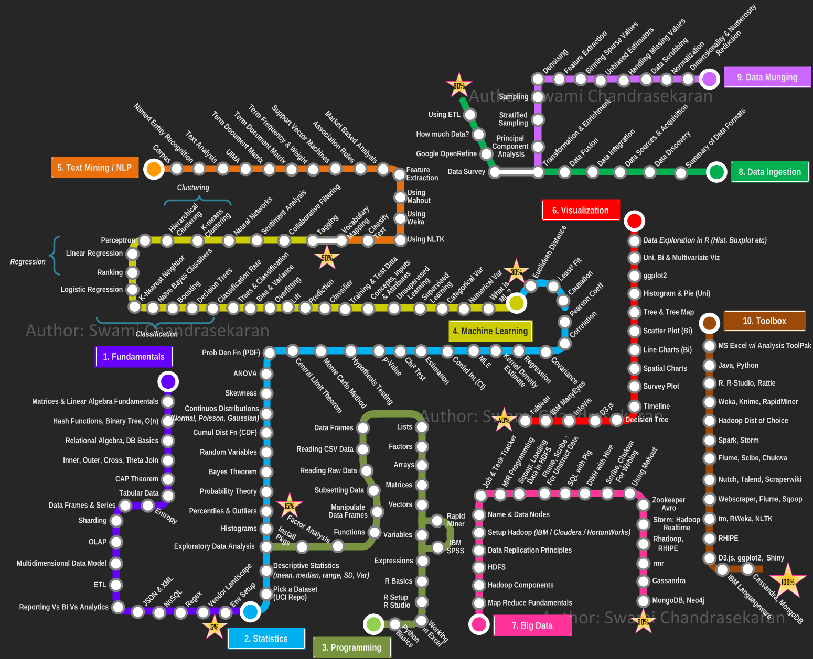

# Data Science with Python

## Roadmap

[**by Swami Chandrasekaran**](https://nirvacana.com/thoughts/2013/07/08/becoming-a-data-scientist/)

## [1. Pandas](/pandas/)

Reference [**Video**](https://youtu.be/CMEWVn1uZpQ?si=sPTD96x7REEJtqzT)

### Projects:

1. Web Scraping with Pandas

### Excercises:

1. Filtering with One Condition
2. Creating Column with One Condtion
3. Creating Column with Multiple Condition
4. Droping Duplicate Elements
5. Selecting elements using iloc()

## [2. Streamlit](/Streamlit/)

Reference [**Video**](https://youtu.be/yKTEC1Y5bEQ?si=4-h9GgkhArkEKiI_)

## 3. Numpy

Documentation [**Webpage**](https://numpy.org/doc/stable/user/basics.html)

Reference [**Video**](https://youtu.be/VXU4LSAQDSc?si=sRrpL1FoFMDeScNL)

For [**Practise**](https://www.geeksforgeeks.org/python/python-numpy-practice-exercises-questions-and-solutions/)

## 4. Matplotlib

Reference [**Video**](https://youtu.be/OZOOLe2imFo?si=HMPrgemrLCrBXCYI)

## 5. Plotly

Reference [**Video**](https://www.youtube.com/playlist?list=PLBSCvBlTOLa8rf2kGkP_Bx5xXqT-er4Yq)

## Misc
Practise [**EDA**](https://www.geeksforgeeks.org/data-analysis/eda-with-NumPy-Pandas-Matplotlib-Seaborn/)